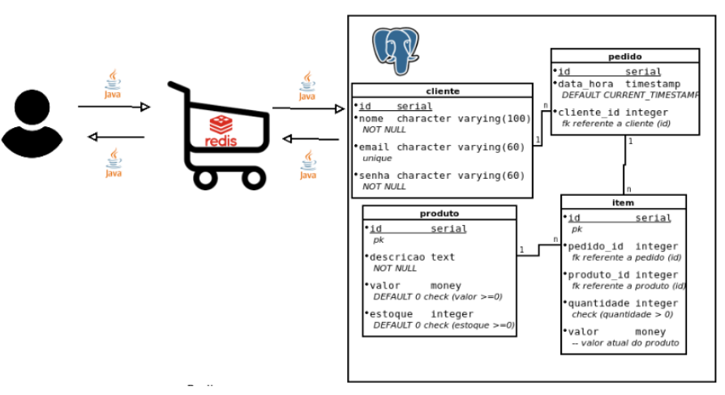

<!--
# Trabalho 2 - Neo4j + MongoDB

#### Descrição do Problema
Desenvolver um sistema básico de gerenciamento de eventos que utilize Java para a lógica de negócios, Neo4j para modelagem de conexões sociais e MongoDB para armazenamento de dados de eventos. 

#### Requisitos do Sistema

1. **Cadastro de Usuários**:
   - Cada usuário deve ter: `cpf`, `nome`, `email`, `senha` e `data_nascimento`.
   - Implementar operações CRUD para gerenciar os usuários.

2. **Modelagem de Conexões Sociais**:
   - Utilizar Neo4j para modelar as conexões sociais entre os usuários (amizades).
   - Implementar funcionalidades para adicionar e remover amizades.

-->

# Trabalho 1 - JPA + Redis

Desenvolvimento de Aplicação E-commerce. <!-- com JPA, PostgreSQL e Redis-->

## Exigências:

* Criar uma aplicação de e-commerce em Java, utilizando JPA para mapeamento objeto-relacional com PostgreSQL e Redis para gerenciamento do carrinho de compras.

* Desenvolver uma API ou Desenvolver o sistema por terminal, por interface gráfica (desktop) ou web;

### No PostgreSQL:
* CRUD para as classes do sistema: Cliente, Pedido e Item. Obs: os produtos podem estar fixamente cadastrados. Obs: para facilitar o desenvolvimento, Produtos tem estoque "infinito"
* Mostrar os pedidos anteriores
* Persistir o pedido (depois de que o cliente pega para fechar o pedido)

### No Redis:
* Criar um Pedido (Carrinho)
* Adicionar Item no Pedido (Carrinho)
* Editar Quantidades de cada Item do Carrinho
* Mostrar o valor parcial e o valor total do Pedido
* Destruir as informacões do Pedido (Carrinho) depois que o pedido seja, efetivamente, salvo no PostgreSQL

## Valor: 5